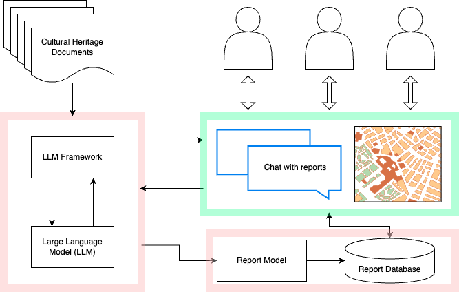

# Analyzing Cultural Heritage Reports using LLM Models

Cultural heritage reports are repositories of valuable spatial, temporal, and domain-specific knowledge pertaining to heritage sites. Analyzing vast volumes of text across numerous reports of heterogeneous structure is challenging and necessitates the development of novel natural language processing techniques. In this project, we propose a solution that utilizes Information Retrieval (IR) and Large Language Model (LLM) text comprehension and generation techniques. Our approach streamlines the process of automatically locating heritage sites from the reports while generating useful information by selecting relevant context. We developed a user interface that visualizes the generated and extracted data and enables interactive dialogue about the content of reports. Our results demonstrate the efficacy of the combined IR, LLM, and geocoding approach in describing heritage site locations.



## Installation

Dependencies:

* python 3.11.4
* flair
* shapely
* flask
* flask_cors
* spacy (with en_core_web_lg)
* langchain
* chromadb
* spatialite (with mod_spatial enabled)
* jupyter notebook

## Usage
To run and load the 7B LLMs, you need to have **NVIDIA GPU** with at least **16GB VRAM** We tested our work with **NVIDIA Tesla V100 PCIe 16 GB**.
### 1. Loading documents

Source folder is defined as a parameter in HVConstants.py, every document in this folder can be simply analysed using:

```commandline
python ChromaProcess.py
```

The results will be saved in ChromaDB (parquet files are available in DB/).

### 2. Extracting Information from documents:

Here, we want to query the reports using IR+QA approach based on LLMs. To do so, you can use the LoadReportServices.

```commandline
python LoadReportServices.py
```


After analysing all documents, the results of information extraction will be stored in a SQLite database (*hv.db*).

### 3. Querying + Visualization

There are two options available:

Using API:
The API must be active and running first, then the REST Webservices are available. Either you can use the API functionalities or use the demo ui, ```simple-ui.html```.
```commandline
python API.py
```

Jupyter Notebook:
The notebook, ```Demo.ipynb```, includes detailed sample code to show case how chunking, loading documents, extraction process are done. In addition, it include querying and chatting with documents. NOTE: Notebook load the LLM without any need for API.py to be active and running.

## Contributors
* Ehsan Hamzei
* Reza Arabsheibani
* Mohammad Kazemi Byedokhti
* Brian Armstrong
* Rui Xing
* Ming-Bin Chen
* Stephan Winter
* Martin Tomko

## Testing Models
The models can be defined and loaded by changing the configuration file ```HVConstants.py```
7-B Models:
* TheBloke/WizardLM-7B-uncensored-GPTQ
* Ejafa/vicuna_7B_vanilla_1.1
* eachadea/vicuna-7b-1.1


## Demo
A Demo of the developed tool is available in ```demo.m4v```.
